# JavaScript Beginner Projects by Ajoy Das


This repository is a collection of beginner-friendly JavaScript projects developed by **Ajoy Das**. Each project is designed to demonstrate specific JavaScript functionality and provide hands-on experience for new developers. It also integrates HTML and CSS for UI design and interaction.

---

## Live Project Showcase


Browse all the projects live in your browser:

```bash
https://codewithajoydas.github.io/JAVASCRIPT-PROJECTS/
````

---

## Projects List

### 1. [Palindrome Checker](https://codewithajoydas.github.io/JAVASCRIPT-PROJECTS/01-palindrome-checker/index.html)

Checks whether a word or sentence reads the same backward.
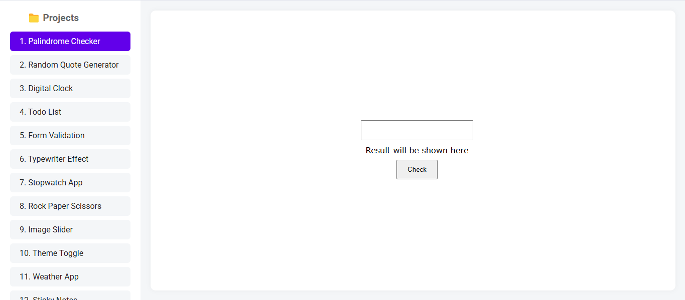

### 2. [Random Quote Generator](https://codewithajoydas.github.io/JAVASCRIPT-PROJECTS/02-random-quote-generator/index.html)

Displays a new random motivational quote on each click.
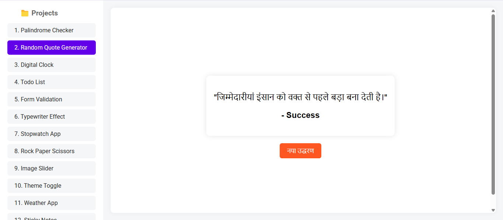

### 3. [Digital Clock](https://codewithajoydas.github.io/JAVASCRIPT-PROJECTS/03-digital-clock/index.html)

A real-time digital clock built with JavaScript.
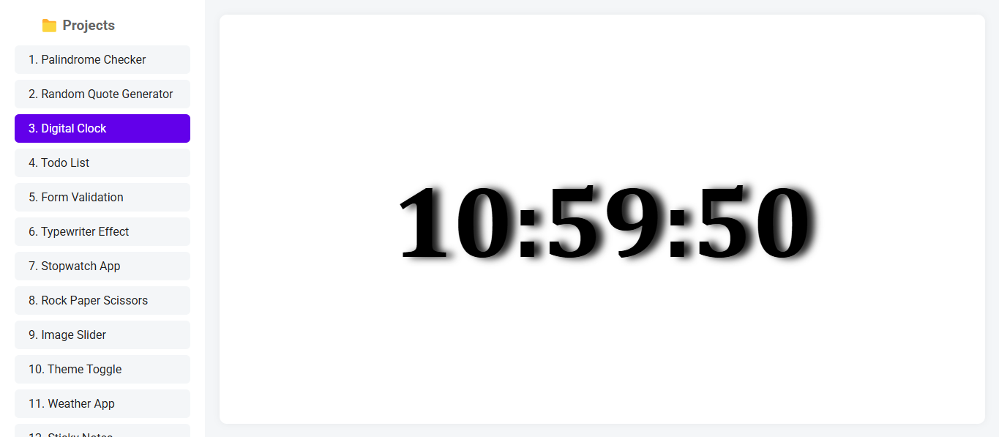

### 4. [Todo List App](https://codewithajoydas.github.io/JAVASCRIPT-PROJECTS/04-todo-list-app/index.html)

Allows users to add, complete, and remove tasks.
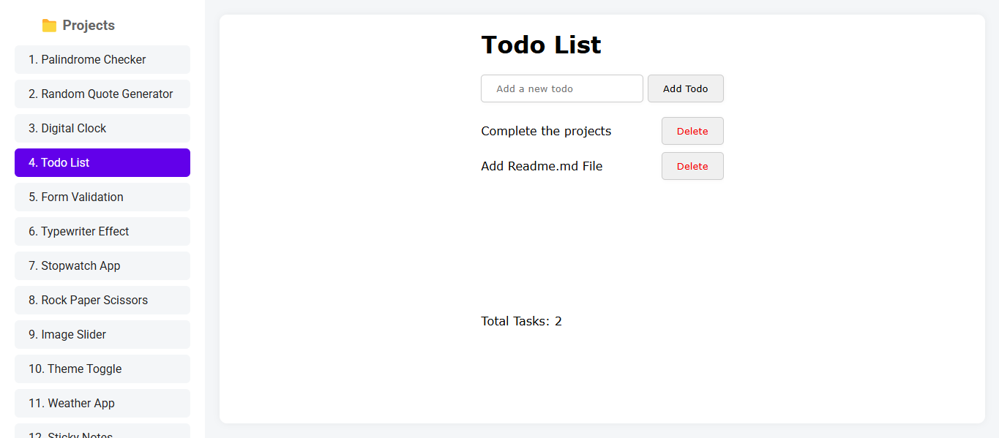

### 5. [Form Validation](https://codewithajoydas.github.io/JAVASCRIPT-PROJECTS/05-form-validation/index.html)

Validates name, email, and password fields using regular expressions.
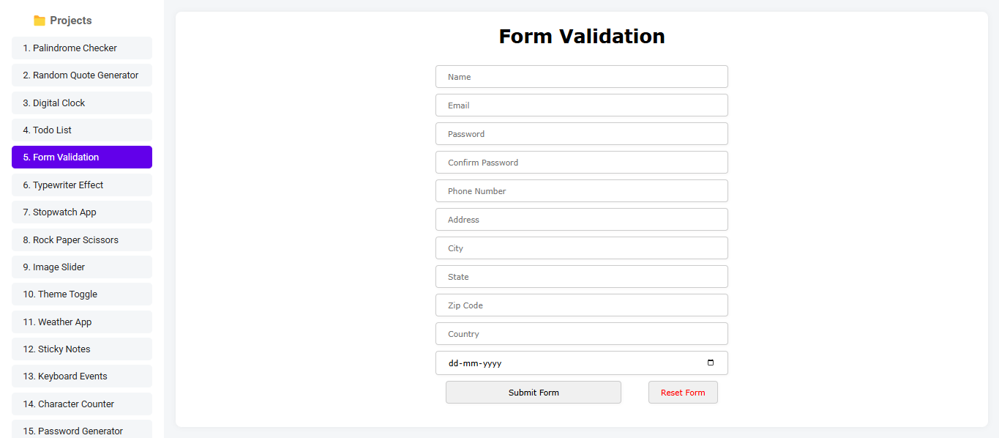

### 6. [Typewriter Effect](https://codewithajoydas.github.io/JAVASCRIPT-PROJECTS/06-typewriter-effect/index.html)

Simulates a typing animation for text.
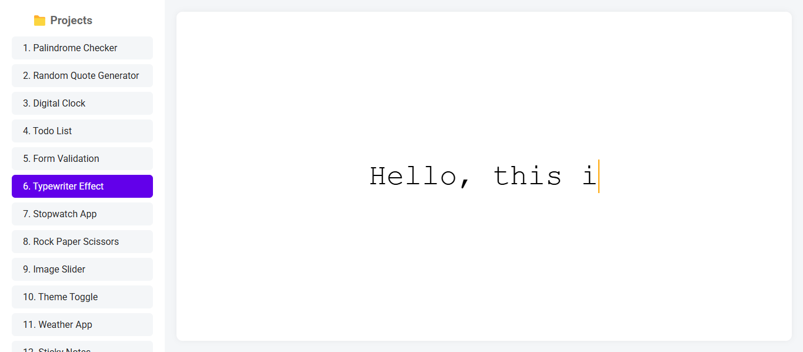

### 7. [Stopwatch App](https://codewithajoydas.github.io/JAVASCRIPT-PROJECTS/07-stopwatch-app/index.html)

Provides start, stop, and reset functions for time tracking.
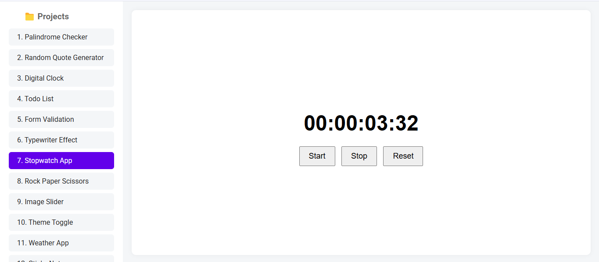

### 8. [Rock Paper Scissors Game](https://codewithajoydas.github.io/JAVASCRIPT-PROJECTS/08-rock-paper-scissors-game/index.html)

A classic game implementation with computer-generated choices.
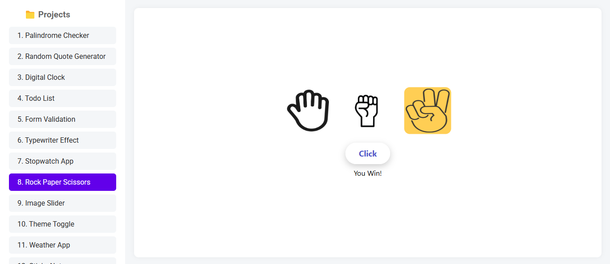

### 9. [Image Slider](https://codewithajoydas.github.io/JAVASCRIPT-PROJECTS/09-image-slider/index.html)

Automatic and manual image slideshow feature.
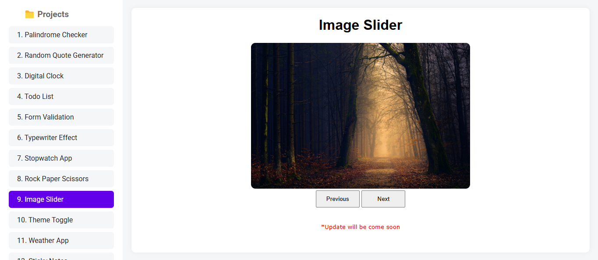

### 10. [Theme Toggle](https://codewithajoydas.github.io/JAVASCRIPT-PROJECTS/10-theme-toggle/index.html)

Switch between light and dark modes dynamically.
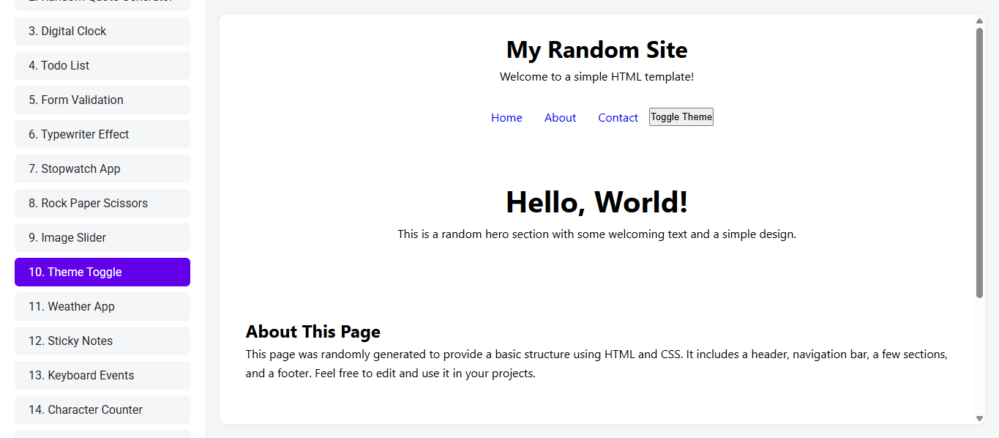

### 11. [Weather App](https://codewithajoydas.github.io/JAVASCRIPT-PROJECTS/11-weather-app/index.html)

Detects user location and displays current weather data using Open-Meteo API.
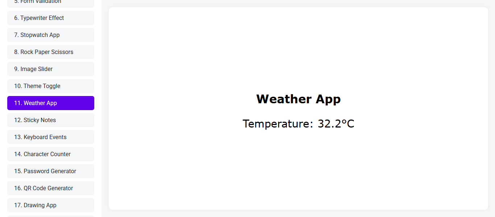

### 12. [Sticky Notes App](https://codewithajoydas.github.io/JAVASCRIPT-PROJECTS/12-sticky-notes/index.html)

Add, delete, and persist sticky notes using `localStorage`.


### 13. [Keyboard Events Game](https://codewithajoydas.github.io/JAVASCRIPT-PROJECTS/13-keyboard-events-game/index.html)

Interactive game responding to keyboard input.
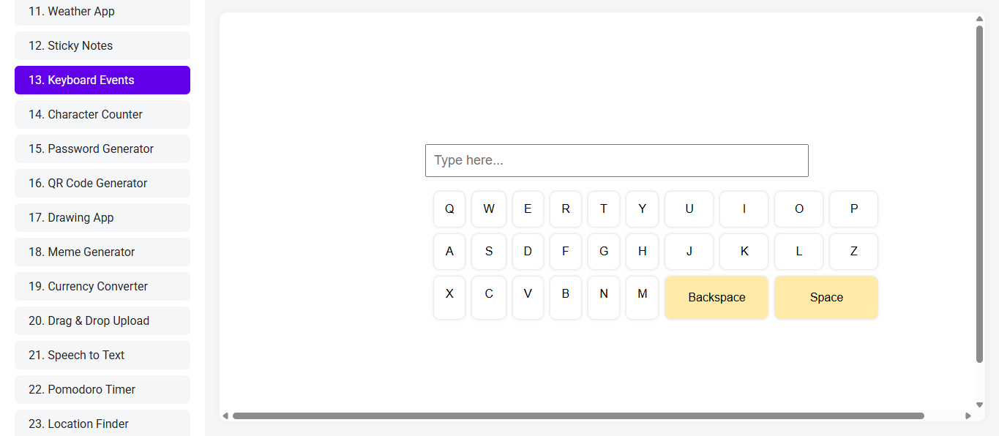

### 14. [Character Counter](https://codewithajoydas.github.io/JAVASCRIPT-PROJECTS/14-character-counter/index.html)

Counts and displays the number of characters as you type.


### 15. [Password Generator](https://codewithajoydas.github.io/JAVASCRIPT-PROJECTS/15-password-generator/index.html)

Generates strong, random passwords with customizable options.
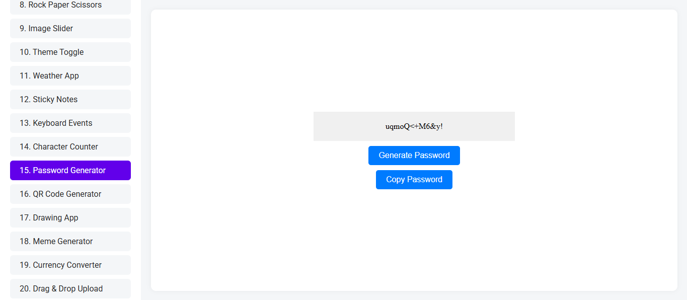

### 16. [QR Code Generator](https://codewithajoydas.github.io/JAVASCRIPT-PROJECTS/16-qr-code-generator/index.html)

Converts user input into a QR code.
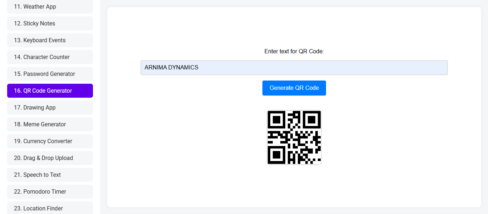

### 17. [Drawing App](https://codewithajoydas.github.io/JAVASCRIPT-PROJECTS/17-drawing-app/index.html)

Allows users to draw freely using mouse or touch input.
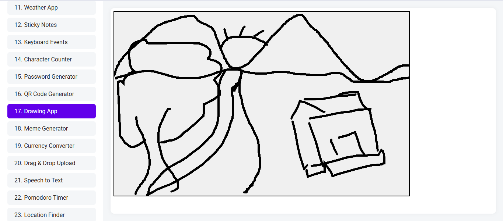

### 18. [Meme Generator](https://codewithajoydas.github.io/JAVASCRIPT-PROJECTS/18-meme-generator/index.html)

Creates memes by overlaying text on random images.
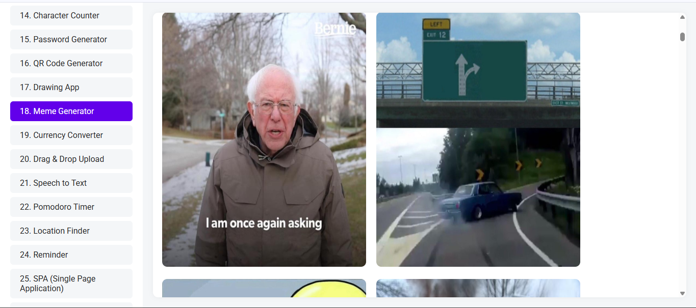

### 19. [Currency Converter](https://codewithajoydas.github.io/JAVASCRIPT-PROJECTS/19-currency-converter/index.html)

Converts currencies using up-to-date exchange rates.
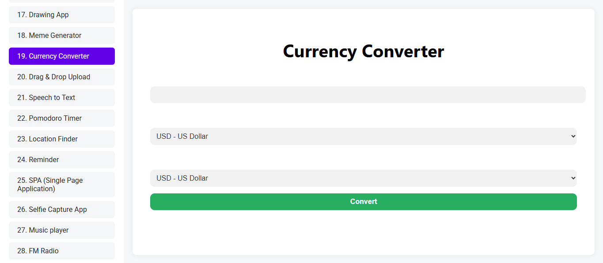

### 20. [Drag & Drop Upload](https://codewithajoydas.github.io/JAVASCRIPT-PROJECTS/20-drag-&-drop-upload/index.html)

Enables file upload via drag-and-drop functionality.
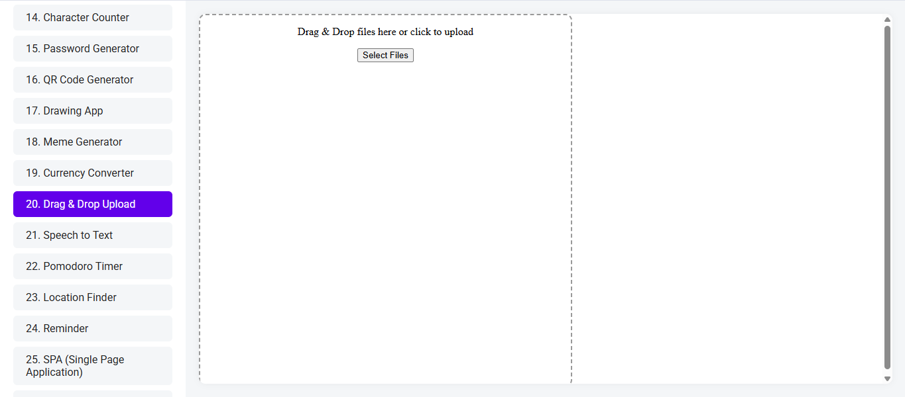

### 21. [Speech to Text](https://codewithajoydas.github.io/JAVASCRIPT-PROJECTS/21-speech-to-text/index.html)

Converts spoken words into text using the Web Speech API.
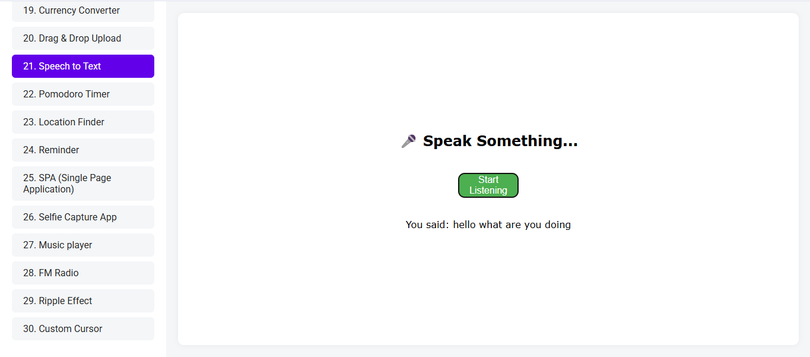

### 22. [Pomodoro Timer](https://codewithajoydas.github.io/JAVASCRIPT-PROJECTS/22-pomodoro-timer/index.html)

Implements the Pomodoro technique to boost productivity.
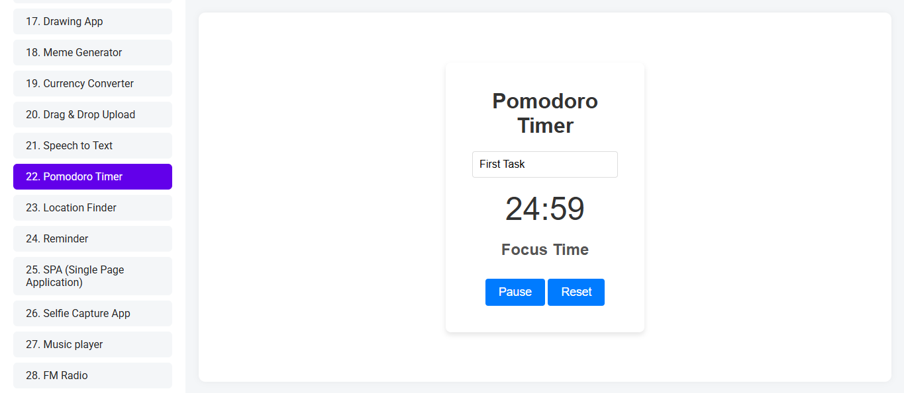

### 23. [Location Finder](https://codewithajoydas.github.io/JAVASCRIPT-PROJECTS/23-Location-Finder/index.html)

Uses the Geolocation API to detect and display your current location.
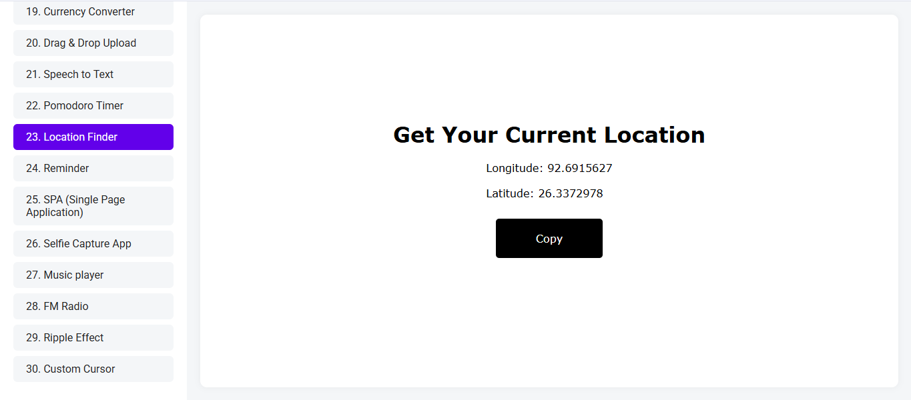

### 24. [Reminder App](https://codewithajoydas.github.io/JAVASCRIPT-PROJECTS/24-Reminder/index.html)

Set task reminders and receive timed notifications.
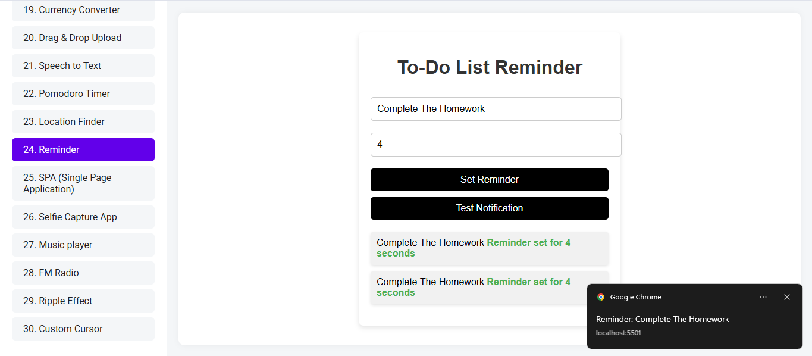

### 25. [Single Page Application (SPA)](https://codewithajoydas.github.io/JAVASCRIPT-PROJECTS/25-SPA/index.html)

Demonstrates dynamic content updates without reloading the page.
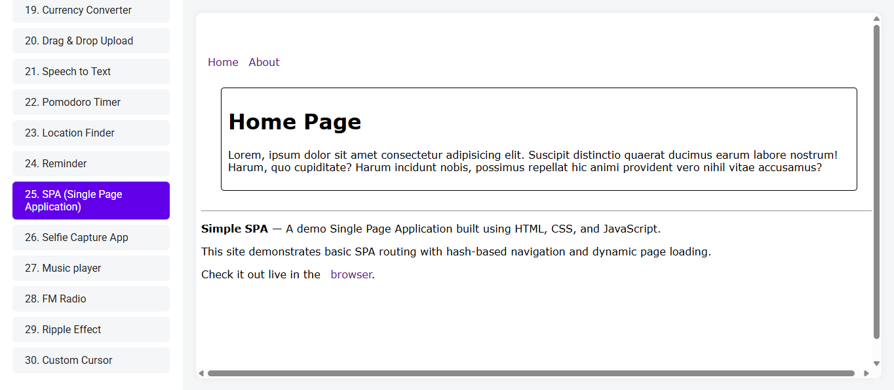

### 26. [Selfie Capture App](https://codewithajoydas.github.io/JAVASCRIPT-PROJECTS/26-Selfie-Capture-App/index.html)

Accesses the webcam to take photos directly from the browser.
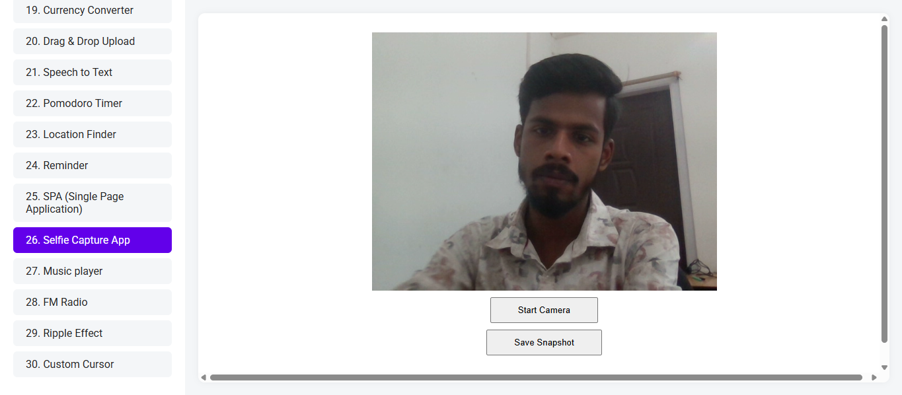

### 27. [Music Player](https://codewithajoydas.github.io/JAVASCRIPT-PROJECTS/27-Music-player/index.html)

Plays audio files with controls for play, pause, and skip.
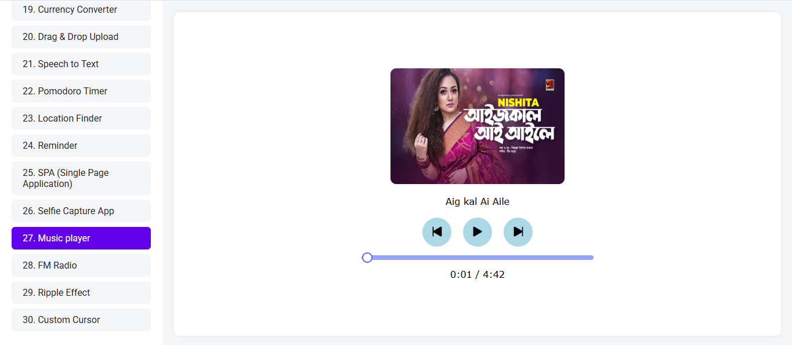

### 28. [FM](https://codewithajoydas.github.io/JAVASCRIPT-PROJECTS/28-FM/index.html)

Streams live radio stations over the internet.


### 29. [Ripple Effect](https://codewithajoydas.github.io/JAVASCRIPT-PROJECTS/29-Ripple-Effect/index.html)

A button with a ripple animation effect.
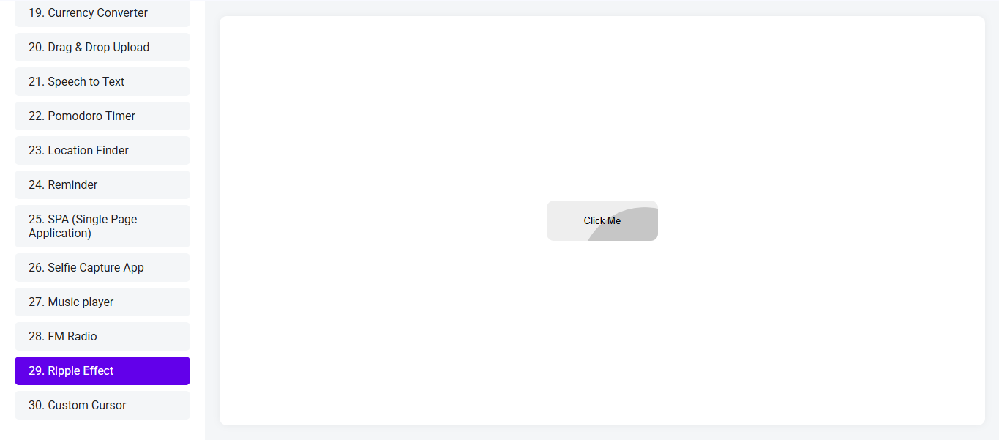

### 30. [Custom Cursor](https://codewithajoydas.github.io/JAVASCRIPT-PROJECTS/30-custom-cursor/index.html)

Replaces the default mouse cursor with a custom design.
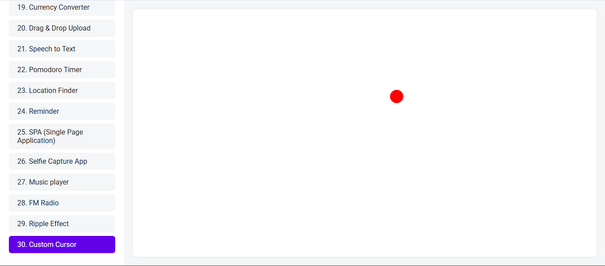

---

## Getting Started

1. **Clone the repository:**

   ```bash
   git clone https://github.com/Codewithajoydas/JAVASCRIPT-PROJECTS
   ```

2. **Open the project folders and run the `.html` files in your browser.**

---

## Contribution Guidelines

Contributions are welcome. You can:

* Fork the repository
* Create a feature branch
* Make changes and commit
* Submit a pull request

Please keep your code clean and well-documented.

---

## License

This project is licensed under the **MIT License**. You are free to use, modify, and distribute this code with proper attribution.
Would you like me to also help you create a `projects.json` or auto-generate this list in the future as you add more projects?
